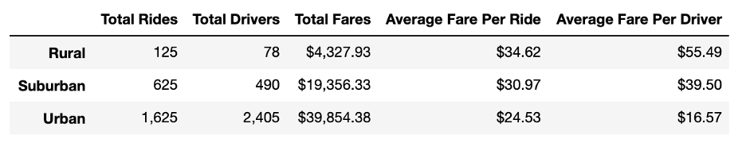

# PyBer_Analysis

## Overview
After being recently employed as a data analyst at PyBer, a colleague Omar and I have been tasked by V.Isualize to create an exploratory analysis  using our knowledge of python scripts and pandas libraries using Jupyter Notebook and Matplotlib to create a chart that showcases the ride sharing data we’ve be given by the designated city type. This analysis also includes an in-depth analysis and visualisation of the relationship between total weekly fares and each city type in order to improve upon their services. 

## Purpose
The intended purpose of this analysis is to provide PyBer improve upon there access to ride-sharing services and determine affordability for underserved neighbourhoods. This analysis will provide PyBer with the appropriate analytical data and visualizations required to make their company more accessible throughout these designated cities. 

## Results 

As can be determined from the table included above there are some significant disparities in the PyBer data between the three city types we have analyzed; Rural, Suburban, and Urban. 

When looking comparatively at the total rides for each city type it can be deduced that the Urban area maintains the highest total ride count (1,625) when compared to the suburban (625) and rural (125) areas. There are many possible explanations for this; Firstly, the disparity between the total ride count in the various city types could possibly be attributed to the number of total drivers available, as the urban area has 2,405 total drivers whereas the rural suburban areas only have a total of 78  and 490 drivers available. The lack of drivers located in the rural cities makes it increasingly difficult for riders to rely on PyBer. 

Additionally, when comparing the average fare per ride it’s determined that the average fare per ride in the Urban area is $10.09 less per ride than in the rural area, and $6.44 less than in the suburban area. This makes PyBer a more affordable option for those living in the Urban cities as opposed to those residing in the other two city types, this is exemplified by the total fares accumulated in each city as the rural area had the smallest total revenue of $4,327.93, the suburban area had $19,356.33 worth of total fares, and the urban city type accrued the highest total fares at $39,854.38. 

Lastly, the average fare per driver located in the rural area is $55.49 which is exponentially higher than the suburban ($39.50) and urban ($16.57) average fare per driver. However, this is compensated by the fact that the urban drivers receive a significantly higher number of rides than in the other cities. 

## Further Recommendations 
After analysing the provided data, I have several recommendations for PyBer to improve upon the current disparities present between its inconsistent services. These recommendations are provided in order to advance in their industry as well as provide riders across all cities with improved services, more affordability, and accessibility.

### 1. Hire More Drivers
 My first recommendation is to make PyBer more affordable for those living in the rural and suburban areas, this could be appropriately addressed by hiring more drivers to work in these specific areas. This would provide riders with more convenience and usability which would in turn generate more rides and increase overall revenue for these areas. 

### 2. Marketing Campaign
An additional recommendation would be to invest in a marketing campaign that targets the underprovided areas. The marketing campaign would encompass a variety of advertisements that would target all demographics and encourage the use of Pyber. 

### 3. Loyalty Program & Discounts 
Lastly, because PyBer has many competitors such as Lyft or Uber, it would be beneficial to jump start a loyalty program that rewards users for using PyBer as opposed to its competitors. For example, for every third use of PyBer they would get a discount for their next ride. 
